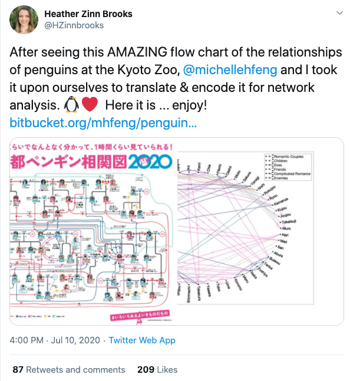

# Module 1 Part 2: Animal Social Network Visualization

You will visualize the network of a population of wild badgers from the [Weber et al. paper](https://doi.org/10.1016/j.cub.2013.09.011) (which is part of this module's writing assignment).  


Python starter code is provided in `part2.py`. You are encouraged to collaborate with others as outlined in the [Collaboration Policy](https://www.reed.edu/biology/courses/bio331/files/collaboration-policy).  Refer to the [Moodle Python Resources](https://moodle.reed.edu/mod/page/view.php?id=141006) page or the [Bio131 Python Crashcourse](https://annaritz.github.io/python-crashcourse/) for Python syntax refreshers.

* **Assignment Out:** Monday, Aug 31
* **Assignment Due:** Monday, Sept 14

## 1. Read the Badger Matrix

The file `BadgerMatrix.txt` contains a table that represents, for every pair of badgers, the number of seconds that the badgers were in contact (we'll call it _contact time_) throughout one year.  The first few rows and columns of this file look like the following:

```
Badger	008p	009p	010p	010y	011y	012b ...
008p		0	0	0	0	0	354 ...
009p		0	0	8	0	102688	0 ...
010p		0	8	0	0	3	0 ...
010y		0	0	0	0	0	0 ...
011y		0	102688	3	0	0	766 ...
012b		354	0	0	0	766	0 ...
...
```

:star: **Task A**: Write a `read_matrix()` function to convert `BadgerMatrix.txt` into a list of nodes and a list of edges.  This function will take one argument (the filename as a string) and return the following variables:
- A `list` of strings representing nodes (badgers)
- A `list` of 3-element lists representing edges (interactions). Each edge `[u,v,t]` will contain the pair of badgers `u` and `v` (strings) and an integer `t` describing the contact time.

Badgers that interact for `0` seconds are ignored.  This _node list/edge list_ representation is a third way to describe a graph (in addition to adjacency matrices and adjacency lists from Part 1.1).

:question: How can a function return two variables? See this [pythontutor example](http://pythontutor.com/visualize.html#code=%23%23%20example%20of%20a%20function%20returning%20two%20variables%0A%0Adef%20f%28%29%3A%0A%20%20%20%20a%20%3D%201%0A%20%20%20%20b%20%3D%20'hi'%0A%20%20%20%20return%20a,b%0A%20%20%20%20%0Aret_a,ret_b%20%3D%20f%28%29%0Aprint%28'Values%20returned%20are',ret_a,'and',ret_b%29%0A%0Aret%20%3D%20f%28%29%0Aprint%28'If%20only%20one%20variable%20is%20specified,%5Cna%20tuple%20is%20returned%3A',ret%29%0A%0Aprint%28'Done.'%29&cumulative=false&curInstr=0&heapPrimitives=nevernest&mode=display&origin=opt-frontend.js&py=3&rawInputLstJSON=%5B%5D&textReferences=false).

:question: How to read information from a file?  See the [Bio131 Python Crashcourse](https://annaritz.github.io/python-crashcourse/) and [Python Standard Library](https://docs.python.org/3/tutorial/inputoutput.html#reading-and-writing-files) descriptions.

:question: How to split a string into a list?  See the [Bio131 Python Crashcourse](https://annaritz.github.io/python-crashcourse/).

## 2. Read the Badger Information

The file `BadgerInfo.txt` contains three pieces of information for every badger: (1) sex (Male or Female), (2) infection status (P for positive and N for negative); and (3) social group (an integer from 1 to 8).

```
Badger	Sex	Infection Status	Social Group
010y	Male	P	1
016p	Male	N	1
035p	Female	N	1
...
```

:star: **Task B**:  Write a `read_info()` function that reads in `BadgerInfo.txt` and returns all three pieces of information for every badger. The type of variable you return is up to you, though [dictionaries](https://docs.python.org/3/library/stdtypes.html#mapping-types-dict) may be helpful here.  This function takes one argument (the filename as a string).

## 3. Post and Annotate the Graph

_Note: we will go over preliminaries for this step in Lab 2.  From now on, decide your own functions and function names - code organization and clarity is helpful._

:star: **Task C**: Follow the instructions from Lab 2 to make a GraphSpace graph object and post this graph to [GraphSpace](http://graphspace.org/).  The `post_graph()` function is provided in the starter code.  Remember the trick to include a timestamp in the title when you are working on drafts of graphs.

:question: Refer to the [Python GraphSpace Cheatsheet](https://cheatography.com/annaritz/cheat-sheets/graphspace-python-client/) for graph syntax.

:star: **Task D**: Annotate the nodes and edges in the graph in the following ways:

1. Visually denote badger sex, TB status, and social group. You can modify node shape, color, size line width, etc.
2. Add a popup to the nodes that lists this information.  You add the `popup` argument when adding nodes and edges to the GraphSpace object, and it takes an HTML-formatted string as a value.  To [format text in HTML](http://www.simplehtmlguide.com/cheatsheet.php), here are some common tags:

```
Regular text is fine. <i>Make this text italic.</i> <b>Make this text bold</b>
Add a line break <br> between the words break and between.
```

3. Adjust the line width/thickness according to contact time. You will need to either scale the contact time or convert times to a log scale in order to make the graph understandable.
4. Save a visually appealing layout that corresponds to the social group spatial configuration.  (If you compare your layout to Figure 1 from the paper, the data here is _slightly_ different).

## Challenge: Visualize a Penguin Social Network

**Challenges are optional, but encouraged if you finish the assignments with extra time.**  In early July, a complicated map of penguin relationships at the Kyoto Zoo was translated into English and converted into an animal social network:



This network is stored in a [BitBucket repository](https://bitbucket.org/mhfeng/penguins_of_kyoto/src/master/) (BitBucket is another type of repository for code, much like GitHub).  Select a subset of this social network and (penguin information and relationship types) and visualize it in GraphSpace. Share your graph and submit your code in the same way you submit the badger network.

## Submitting

:star2: **You're Done with Tasks A-D!**  Change your code to post your final GraphSpace graph:
1. Remove the timestamp from your graph title.
2. Add the `Module1` tag (e.g. `G.set_tags(['Module1'])`)
3. Share your final network with the `BIOL331F20` GraphSpace Group (e.g. call `post_graph()` with the additional argument `group='BIOL331F20'`).  

:question: How does `post_graph()` handle optional and named arguments? See this [Dive into Python tutorial](https://linux.die.net/diveintopython/html/power_of_introspection/optional_arguments.html).

Run your code one more time to post and share your final network. You can delete any leftover graphs by clicking the `Remove` button on the GraphSpace website (this is optional).

Before you submit `part2.py` via Moodle, document your code.  Add comments, rearrange functions, etc., to make it readable.  You will get feedback about the amount of comments you provide.

### Instructions for resubmitting

As described on the [syllabus](https://www.reed.edu/biology/courses/bio331/files/syllabus.pdf), there is no penalty for re-submitting this assignment as long as you follow the instructions below. All resubmissions are due by Finals Week - ask Anna if you have any questions.

* You submit whatever you have by the deadline.
* You add a comment to the top of your code indicating that you plan to resubmit this assignment (e.g. "I plan to resubmit this assignment.")
* You schedule a meeting with Anna within one week of the deadline to make a plan.
